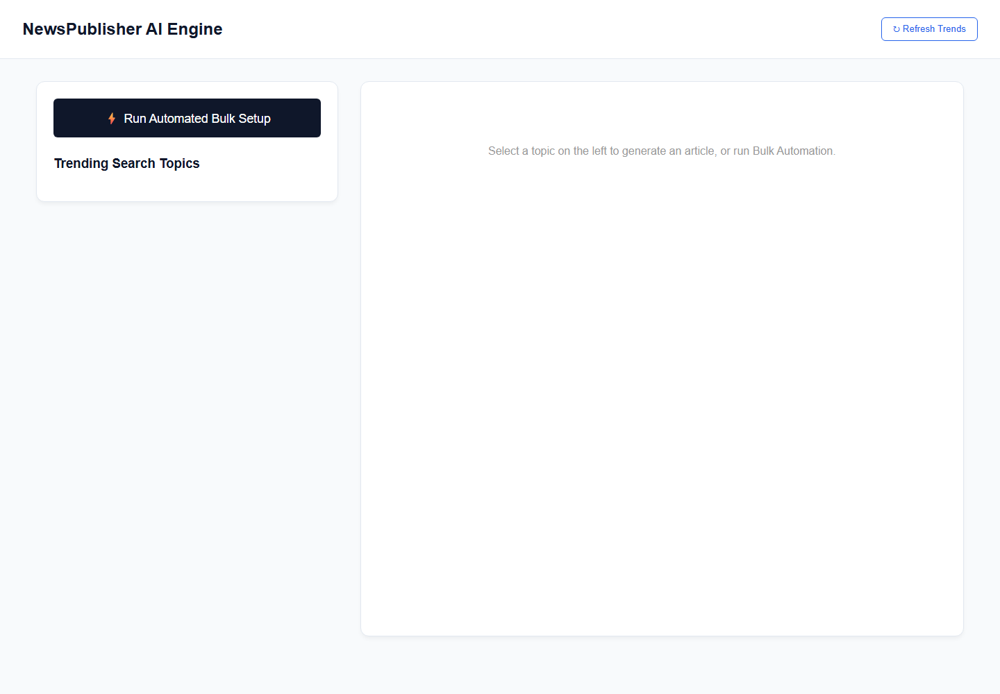
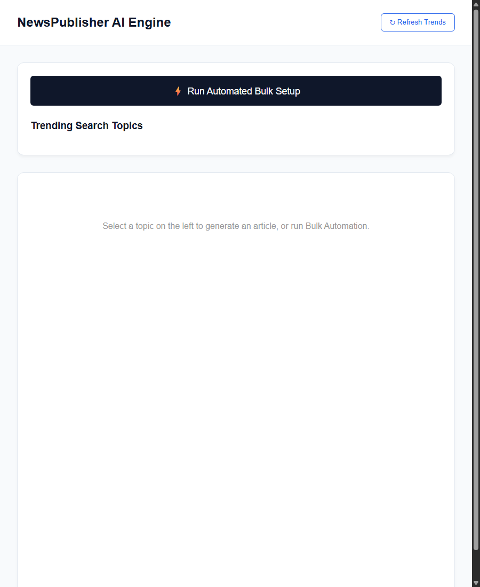
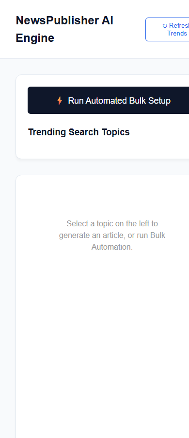

# AI-News-Finder-and-Generator-

AI news finder and generator built with Next.js.

## Project Screenshots

### Desktop



### Tablet



### Mobile



## Getting Started

Install dependencies:

```bash
npm install
```

Run the development server:

```bash
npm run dev
```

Open [http://localhost:3000](http://localhost:3000) in your browser.

## Scripts

```bash
npm run dev
npm run build
npm run start
npm run lint
```

## Tech Stack

- Next.js
- React
- Tailwind CSS
- Google GenAI
- RSS Parser
